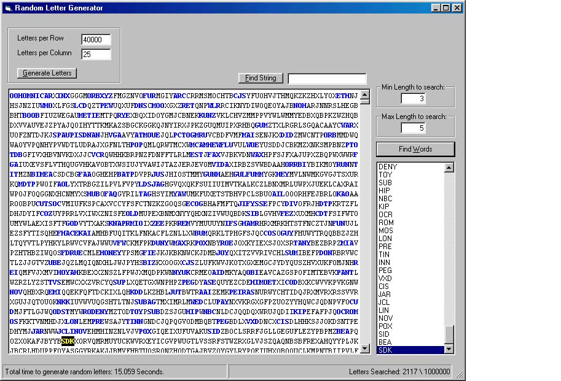



## Random Letter Generator

### Description

Actually this is kind of fun. This program genaerates 1000000 completely random letters and then uses the microsoft Word Spell check object to look for real words. You can specify the minimum length of text to search for as well as maximum and it will highlight real words. i put an Algorythm that looks for words based on each character position, for example, if "WHOLE" is found it will return 3 words, "Whole", Hole", and OLE". You would be surprised to see some of the words that are generated. Oh well, good for a dyno test on your computer at least. Comments and votes are greatly appreciated.
 
### More Info
 
Download and run.

You do need MS word though.

             |
---                |---
**Submitted On**   |2000-08-14 12:39:42
**By**             |[Brian Bender](https://github.com/Planet-Source-Code/PSCIndex/blob/master/ByAuthor/brian-bender.md)
**Level**          |Intermediate
**User Rating**    |4.5 (18 globes from 4 users)
**Compatibility**  |VB 6\.0
**Category**       |[String Manipulation](https://github.com/Planet-Source-Code/PSCIndex/blob/master/ByCategory/string-manipulation__1-5.md)
**World**          |[Visual Basic](https://github.com/Planet-Source-Code/PSCIndex/blob/master/ByWorld/visual-basic.md)
**Archive File**   |[CODE\_UPLOAD89548142000\.zip](https://github.com/Planet-Source-Code/brian-bender-random-letter-generator__1-10683/archive/master.zip)

